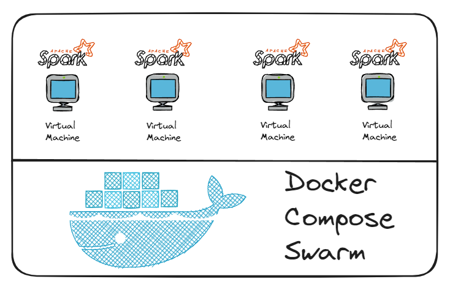

# Cluster Spark on Docker Swarm

## Arquitetura


## Pré-requisitos
* Docker

## Como desbloquear os pré-requisitos?

https://www.youtube.com/playlist?list=PLbPvnlmz6e_L_3Zw_fGtMcMY0eAOZnN-H

## Como usar os códigos do projeto?
Clone o repositório
```
git clone https://github.com/wlcamargo/cluster_spark 
```
Entre na pasta
```
cd cluster_spark 
```
Execute o comando para baixar a imagem e rodar o container
```
sudo docker compose up -d 
```
Verifique se os serviços estão ok
```
derrube os containers depois de instalar e testar
```

## Modo Swarm
Inicie o modo Swarm do Docker
```
docker swarm init
```
Cole o token nos outros nodes

Por último, aplique a stack no Docker Swarm
```
sudo docker stack deploy -c docker-compose.yml cluster_spark
```

## Como acessar os serviços?

Jupyter: localhost:8888
Cluster-Spark: localhost:8080

## Referência
https://docs.docker.com/engine/swarm/

https://spark.apache.org/docs/latest/

## Developer
| Desenvolvedor      | LinkedIn                                   | Email                        | Portfólio                              |
|--------------------|--------------------------------------------|------------------------------|----------------------------------------|
| Wallace Camargo    | [LinkedIn](https://www.linkedin.com/in/wallace-camargo-35b615171/) | wallacecpdg@gmail.com        | [Portfólio](https://wlcamargo.github.io/)   |
